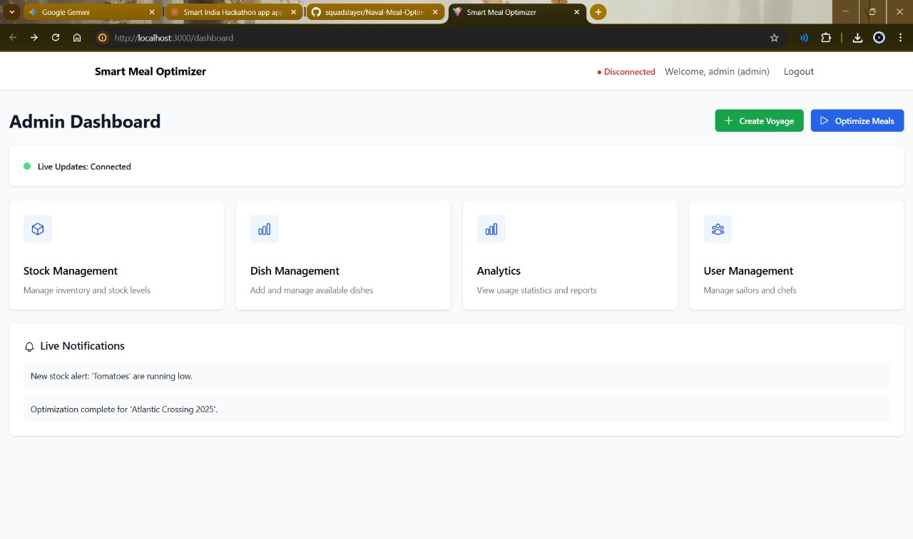
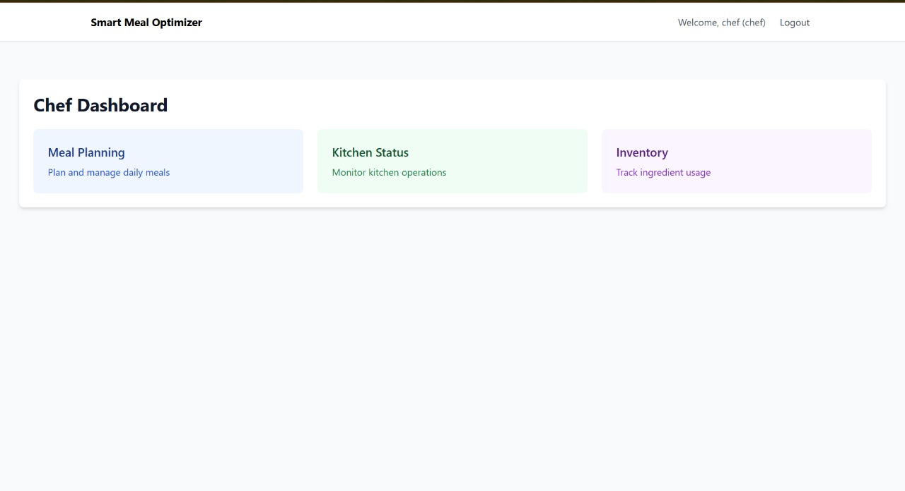
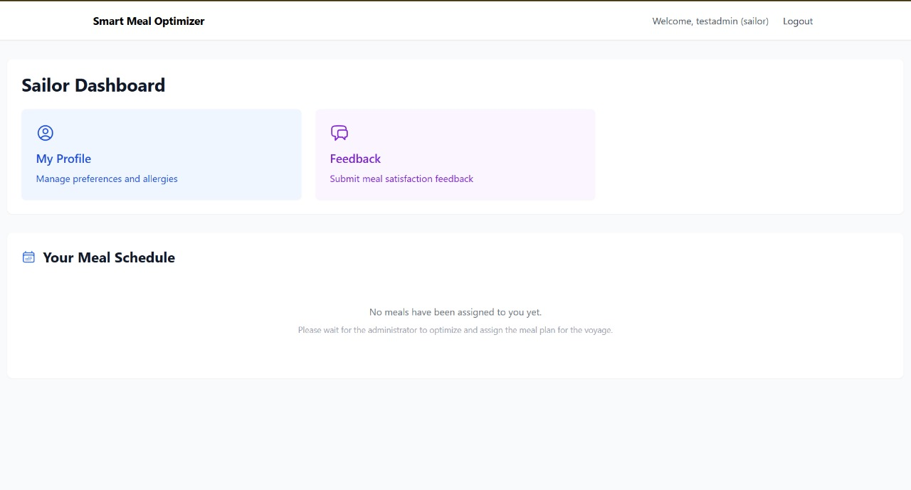

# 🌊 Naval Meal Optimizer System  
_A complete role-based meal planning and optimization platform designed for long-duration voyages._

---

## 🚀 Overview  
This system automates meal scheduling, ingredient stock planning, satisfaction tracking, and dietary management for naval crew members onboard. It improves logistics efficiency by minimizing waste, complying with nutritional needs, and ensuring optimal stock utilization through computational optimization.

---

## 🎯 Key Objectives  
- Optimize meal plan with minimal wastage  
- Track stock usage and generate real-time alerts  
- Maintain dietary preferences and allergies  
- Provide role-based operational dashboards  
- Automate kitchen and inventory workflows  

---

## 🧠 Core Features  

### 🌐 Admin  
- Create and manage voyages  
- Track ingredient stock & warning alerts  
- Assign chefs and sailors  
- Run optimization engine  

### 🍳 Chef  
- Schedule daily meals  
- Monitor ingredient usage  
- Update kitchen status  
- Track consumption statistics  

### ⚓ Sailor  
- Manage profile, allergies & preferences  
- Submit meal satisfaction feedback  
- View personalized meal schedule  

---

## 🖥️ Application Screenshots

### ⭐ Admin Panel


---

### ⭐ Chef Panel


---

### ⭐ Sailor Panel


---

## 🏗️ System Architecture  

```
Frontend → REST APIs / WebSockets → Django Backend  
    |                |  
React UI            Redis (Messaging & Notifications)  
    ↓                ↓  
Local Storage       PostgreSQL Database  
```

---

## ⚙️ Tech Stack

| Category | Technologies |
|---|---|
| Frontend | React, Vite, TailwindCSS, Axios |
| Backend | Django, Django REST Framework |
| Authentication | JWT |
| Database | PostgreSQL |
| Async Tasks | Celery |
| Real-time Updates | Django Channels + Redis |
| Deployment Ready | Docker, Railway, Render, AWS |

---

## 📦 Project Structure  

```
Naval-Meal-Optimizer-System/
│── backend/
│── frontend/
│── assets/
│── README.md
```

---

## 🔑 Authentication & User Levels  

✔ JWT Tokens  
✔ Protected APIs  
✔ UI-level route guarding  
✔ Role-based data access  

| Role | Access Description |
|---|---|
| Admin | Full CRUD, optimization triggering |
| Chef | Meal planning & kitchen tracking |
| Sailor | Feedback & profile management |

---

## 📊 Optimization Logic  

The system evaluates:

- Inventory availability  
- Ingredient demand per dish  
- Crew preferences  
- Allergy constraints  
- Consumption patterns  

Then generates:  
✔ Balanced meal schedules  
✔ Minimal wastage plans  
✔ Stock usage prediction  

---

## 🛠️ Installation & Setup

### Backend Setup
```bash
cd backend
python -m venv venv
venv/Scripts/activate  # Windows
pip install -r requirements.txt
python manage.py migrate
python manage.py createsuperuser
python manage.py runserver
```

---

### Frontend Setup
```bash
cd frontend
npm install
npm run dev
```

---

## 🔗 Environment Variables  
Create `.env` in backend root:

```
SECRET_KEY=
DATABASE_URL=
REDIS_URL=
DEBUG=True
ALLOWED_HOSTS=*
```

---

## 🧪 Testing
```bash
python manage.py test
```

Planned tests include:
- API validations  
- Stock prediction simulation  

---

## 📈 Future Enhancements  
- Automatic ingredient reorder prediction  
- ML-based satisfaction scoring  
- Automated PDF report generation  
- Multi-voyage simulation engine  
- Mobile-friendly progressive web app  

---
